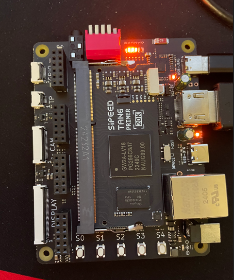

# Gowin FPGA Design Projects
Designed and developed by Alican Yengec

This repository contains FPGA design work for the Gowin G2WA model on the Sipeed Tang Primer development board.

Designed and developed by Alican Yengec, this collection focuses on practical FPGA experiments and demos built with macOS-friendly workflows while also supporting Windows and Linux toolchains.

Many of the project READMEs also include YouTube video links for the demos and build examples.

## What’s inside

* DDR3 + UART test projects with a menu-driven interface
* HDMI video output and color bar demonstration designs
* WS2812 RGB LED control with push-button interaction
* FPGA design flows that work on macOS
* Example RTL and board constraints for real Gowin hardware

## Featured Project Videos

Watch the live hardware demos directly on YouTube:

| Demo | Project | Description |
| --- | --- | --- |
|  | [hdmi_ayengec_demo](./hdmi_ayengec_demo) | Tang Primer HDMI output bring-up |
|  | [macos_led_knight_rider](./macos_led_knight_rider) | LED Knight Rider demo |
|  | [macos_rgb_led_w_button_ws2812](./macos_rgb_led_w_button_ws2812) | WS2812 RGB LED color and brightness control with buttons |
|  | [macos_lcd_spi_and_dht22](./macos_lcd_spi_and_dht22) | SPI TFT display demo with One-Wire DHT22 temperature and humidity monitoring |

## Why this repository exists

The purpose of this repo is to show that FPGA design is not limited to Windows-only environments. As a designer, I want to prove that macOS users can also develop and build Gowin FPGA projects with confidence.

## What’s coming next

Future projects and updates will include:

- additional DDR and memory interface examples
- more video output and display demos
- embedded control and mixed-signal FPGA designs
- improved notes on macOS tooling and setup

## Notes

This repository is actively evolving. New project folders and design examples will be added over time, so check back for updates.
