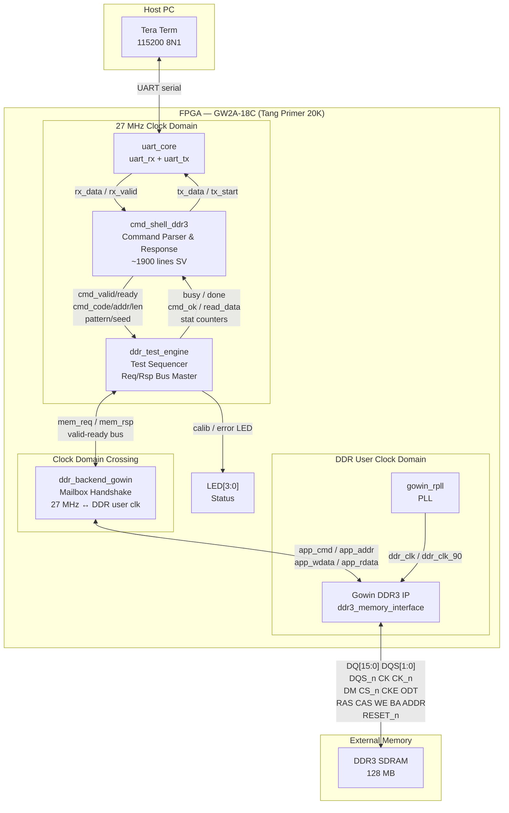

<div align="center">

# DDR3 UART Tester — Tang Primer 20K

**Interactive DDR3 memory tester for the Sipeed Tang Primer 20K (GW2A-18C)**
Control external DDR3 from a serial terminal. Single-word access, block verify, bank sweep, full 128 MB validation.

---


**Designer:** Alican Yengec &nbsp;·&nbsp; **Language:** SystemVerilog 2017 &nbsp;·&nbsp; **Tool:** Gowin EDA

</div>

---

## What This Project Is

A production-grade DDR3 test shell, fully verified on real silicon.

You power up the board, open Tera Term at `115200 8N1`, and from that moment you can interrogate every byte of the 128 MB DDR3 through a typed command interface: read/write single words, run fill-and-verify block tests, sweep all four 32 MB banks, stress the entire address space with six different data patterns, and pull cumulative read/write/error statistics at any time — with first-error address, expected value, and actual value captured automatically.

No external logic analyser needed. No JTAG probe. Just a USB-to-serial adapter and Tera Term.

> **Proof in three lines:**
> ```
> > mi       →  CAL=1  BUSY=0
> > fa 05    →  WR=02000000  RD=02000000  ER=00000000
>              RESULT=PASS
> ```

---

## Architecture



---

## Module Map

| File | Lines | Role |
|---|---|---|
| `rtl/top_ddr3_uart_tester.sv` | ~130 | Top-level integration, POR, wire routing |
| `rtl/cmd_shell_ddr3.sv` | ~1906 | UART command parser, text response generator, help menu |
| `rtl/ddr_test_engine.sv` | ~350 | Backend-agnostic test sequencer, statistics, LFSR engine |
| `rtl/ddr_backend_gowin.sv` | ~310 | CDC mailbox bridge, Gowin DDR3 app-interface driver |
| `rtl/uart_core.sv` | ~50 | RX + TX wrapper |
| `rtl/uart_rx.sv` / `uart_tx.sv` | ~200 | 8N1 bit-level serial codec |
| `ip/gowin_rpll/gowin_rpll.v` | — | Gowin PLL IP for DDR clock generation |
| `ip/ddr3_memory_interface/` | — | Gowin DDR3 controller IP wrapper |

---

## Design Notes (Why It's Built This Way)

### Clock Domain Crossing
The UART shell and test engine run on the board's native **27 MHz** oscillator — simple, no jitter, easy timing closure. The Gowin DDR3 IP runs its app interface on a separate **DDR user clock** that the PLL derives. Rather than over-engineering a FIFO-based CDC, `ddr_backend_gowin` uses a **one-request mailbox handshake**: the 27 MHz side sets a request register and waits; the DDR clock side sees it, executes, and sets a done register back. Clean, verifiable, zero metastability ambiguity.

### Backend-Agnostic Test Engine
`ddr_test_engine` talks to memory through a minimal `req_valid/req_ready/rsp_valid/rsp_ok` bus and knows nothing about Gowin IP. Swap `ddr_backend_gowin` for a simulation model, an AXI bridge, or a different vendor's controller — the test engine, shell, and UART layer stay untouched.

### Timeout Guard
At 27 MHz, `RSP_TIMEOUT_CYCLES = 27_000_000` gives a **1-second hardware timeout** if the DDR backend never responds. The engine asserts `cmd_ok=0` and returns to idle instead of hanging. This is the difference between a dev tool and a production-grade tool.

### First-Error Capture
On the first miscompare, the engine latches the **word address, expected pattern, and actual read-back** into dedicated registers accessible via `st`. You see exactly where the memory fails, not just a count.

---

## UART Setup (Tera Term)

| Parameter | Value |
|---|---|
| Baud rate | `115200` |
| Data bits | `8` |
| Parity | `None` |
| Stop bits | `1` |
| Flow control | `None` |
| New-line transmit | `CR` or `CR+LF` |
| Local echo | **ON** |

On power-up / reset:
```
*** AYENGEC DDR3 GW2A TEST PROJECT ***
Type HELP for menu
>
```

---

## Command Reference

| Command | Syntax | Description |
|---|---|---|
| `help` | `help` | Print full command menu |
| `mi` | `mi` | Show calibration status (`CAL`) and busy flag |
| `mr` | `mr AAAAAAAA` | Read one 32-bit word from byte address |
| `mw` | `mw AAAAAAAA DDDDDDDD` | Write one 32-bit word to byte address |
| `md` | `md AAAAAAAA LLLLLLLL` | Dump `L` words starting at address |
| `mb` | `mb AAAAAAAA LLLLLLLL PP` | Fill + verify `L` words from address with pattern `PP` |
| `bb` | `bb LLLLLLLL PP` | Bank sweep: fill + verify across 4 × 32 MB regions |
| `fa` | `fa` or `fa PP` | Full 128 MB test (4 regions × 0x0800000 words) |
| `st` | `st` | Print cumulative RD/WR/ER + first-error record |
| `clr` | `clr` | Clear all counters and first-error state |

> All addresses are **byte addresses**, must be **4-byte aligned**.

---

## Pattern Codes

| Code `PP` | Pattern | Use case |
|---|---|---|
| `00` | `0x00000000` | Stuck-at-1 detection |
| `01` | `0xFFFFFFFF` | Stuck-at-0 detection |
| `02` | `0xAAAAAAAA` | Alternating bits (coupling) |
| `03` | `0x55555555` | Inverse alternating (coupling) |
| `04` | Address-as-data | Address pin / decoder errors |
| `05` | LFSR sequence | Pseudo-random stress (default `fa` pattern) |

---

## Typical Test Session

```
> mi
CAL=1  BUSY=0

> mw 00001000 DEADBEEF
OK

> mr 00001000
RD=DEADBEEF

> md 00001000 00000004
00001000: DEADBEEF
00001004: xxxxxxxx
00001008: xxxxxxxx
0000100C: xxxxxxxx

> mb 00000000 00000100 04
FILL...VERIFY...OK  WR=00000100 RD=00000100 ER=00000000

> bb 00000080 05
BANK0...PASS  BANK1...PASS  BANK2...PASS  BANK3...PASS

> fa 05
... (128 MB, ~33M reads + 33M writes)
WR=02000000  RD=02000000  ER=00000000
RESULT=PASS

> st
RD=02000000  WR=02000000  ER=00000000
FIRST_ERR: none
```

Full Tera Term log: [`TERATERM_OUTPUT.log`](./TERATERM_OUTPUT.log)

---

## Build Flow

1. Open `ddr3_uart_tester_ayengec.gprj` in **Gowin EDA**.
2. Go to `Project → Configuration → Synthesize` → set Verilog Language to **SystemVerilog 2017**.
3. Run **Synthesis**.
4. Run **Place & Route**.
5. Generate and program **bitstream**.
6. Connect USB-to-serial to the Tang Primer 20K UART pins.
7. Open Tera Term with the settings above and type `help`.

Constraints:
- Pin / IO: `constraints/ddr3_uart_tester.cst`
- Timing: `constraints/ddr3_uart_tester.sdc` — base constraint is the 27 MHz input clock; DDR timing is handled inside the Gowin DDR3 IP.

---

## DDR3 Quick Reference

A compact cheat sheet for bring-up and testing. Experienced engineers can skip this; newcomers should read it before touching the commands.

### Core Concepts

| Term | Meaning |
|---|---|
| DDR | Double Data Rate — data transferred on both clock edges |
| Rank | Logical memory group, selected with `CS_n` |
| Bank | Sub-block inside the DRAM; different banks allow parallelism |
| Row | Large cell line that must be opened first (`ACT`) |
| Column | Location inside the open row, accessed by `READ/WRITE` |
| Burst | One command transfers multiple beats (DDR3: BL8) |

### Control Plane Pins

| Pin(s) | Function |
|---|---|
| `CK / CK_n` | Differential clock |
| `CS_n` | Chip / rank select |
| `RAS_n, CAS_n, WE_n` | Command encoding |
| `A[13:0]` | Row address / column address / mode register bits |
| `BA[2:0]` | Bank select |
| `CKE` | Clock enable / power state |
| `ODT` | On-die termination control |
| `RESET_n` | Global DRAM reset |

### Data Plane Pins

| Pin(s) | Function |
|---|---|
| `DQ[15:0]` | Bidirectional data bus |
| `DQS[1:0] / DQS_n[1:0]` | Source-synchronous data strobes |
| `DM[1:0]` | Byte-lane write mask |

### Access Flow

**Write path**
1. `ACT` → open target row in target bank
2. Wait `tRCD`
3. `WRITE` at target column (optionally auto-precharge)
4. Respect `tWR` write recovery → precharge

**Read path**
1. `ACT` → open target row in target bank
2. Wait `tRCD`
3. `READ` at target column
4. Data returns after `CL` (CAS latency) on `DQS`
5. Precharge (manual or auto)

### Critical Timings

| Timing | Meaning |
|---|---|
| `tCK` | Clock period |
| `CL` | CAS latency: READ command to first valid data |
| `tRCD` | ACT to READ/WRITE minimum delay |
| `tRP` | Precharge time before next row in same bank |
| `tRAS` | Minimum row active time |
| `tRC` | Full row cycle (`tRAS + tRP`) |
| `tWR` | Write recovery before precharge |
| `tRFC` | Refresh cycle time |

### Capacity Formula

```
Capacity (bits) = Rows × Columns × Banks × DQ_width
```

Always confirm with the exact DDR3 part datasheet — x8 vs x16 organisation and row/column bit counts change everything.

### Bring-Up Checklist (No Scope Required)

1. `mi` → confirm `CAL=1` before anything else.
2. `mw` then `mr` on the same aligned address — verify round-trip.
3. Short `mb` (small length) before large block tests.
4. `bb` to stress all four banks.
5. `fa` only after the above all pass.
6. `st` after every step — watch `ER` stay zero.

### Common Failure Signatures

| Symptom | Likely cause |
|---|---|
| `CAL=0` | DDR PHY not calibrated — check clock, reset, constraints |
| Immediate ERR on `mr`/`mw` | Interface handshake / timing / reset issue |
| ERR only on long tests | Timing margin, CDC, or signal integrity sensitivity |
| Garbage on UART | Serial settings mismatch or baud clock error |
