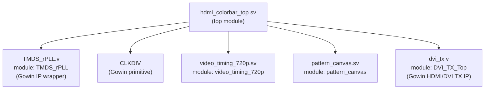

# Tang Primer 20K HDMI Pattern Demo

## Header
- Designer: Alican Yengec
- Summary: Custom HDMI bring-up demo written in SystemVerilog (for user logic), with clear and editable structure.

## What This Project Is
This is a clean HDMI bring-up project for Tang Primer 20K.

Main purpose:
- prove HDMI output path is stable
- verify clocks and video timing
- show a custom animated pattern (not stock color bars)
- keep code readable for future DDR3/SD-card video upgrades

## Why This Architecture
This design is intentionally split into small blocks:
- one timing block
- one pattern block
- one top integration block

Why:
- easier debug when image is wrong
- easier reuse when resolution changes
- easier migration to framebuffer pipeline later

This is Phase-1, so we avoid DDR3 and SD complexity now.
First we lock HDMI output. Then we add memory/video source.

## Board / Device
- Board: Sipeed Tang Primer 20K Dock
- FPGA: GW2A-LV18PG256C8/I7
- Input clock: 27 MHz (`I_clk`, board oscillator)

## File Map (Accurate)
- `src/hdmi_colorbar_top.sv`
  - top-level integration
  - reset strategy
  - PLL + clock divider hookup
  - HDMI TX IP connection
  - LED debug outputs
- `src/video_timing_720p.sv`
  - custom 1280x720 timing generator
  - generates `hs`, `vs`, `de`
  - exports visible coordinates `x`, `y`
  - exports `frame_start` pulse
- `src/pattern_canvas.sv`
  - custom animated test scene compositor
  - base gradient + checker_on + diagonal bands + moving box + center reticle
- `src/gowin_rpll/TMDS_rPLL.v`
  - Gowin-generated PLL wrapper (tool/IP output)
- `src/dvi_tx/dvi_tx.v`
  - Gowin DVI/HDMI TX wrapper (tool/IP output)
- `src/hdmi_colorbar.cst`
  - pin constraints
- `src/hdmi_colorbar.sdc`
  - timing constraints
- `hdmi_colorbar_phase1.gprj`
  - Gowin project file

## Module Structure
The hierarchy below shows only module instantiation structure (not signal flow):



Tree view:

```text
hdmi_colorbar_top
├─ TMDS_rPLL         (from TMDS_rPLL.v)
├─ CLKDIV            (primitive)
├─ video_timing_720p (from video_timing_720p.sv)
├─ pattern_canvas    (from pattern_canvas.sv)
└─ DVI_TX_Top        (from dvi_tx.v)
```

## SystemVerilog vs Verilog Note
User logic is written in SystemVerilog:
- `hdmi_colorbar_top.sv`
- `video_timing_720p.sv`
- `pattern_canvas.sv`

Two files are Verilog because they are generated Gowin IP wrappers:
- `TMDS_rPLL.v`
- `dvi_tx.v`

So the design style is SV for editable logic, Verilog only for vendor IP shell files.

## Clocking and Reset (Why It Is Done This Way)
Clock chain:
1. 27 MHz board input clock enters PLL
2. PLL outputs TMDS serial clock
3. `CLKDIV` creates pixel clock from serial clock (divide-by-5)
4. Pixel-domain logic runs timing + pattern blocks

Reset chain:
- system reset is active-low input `I_rst_n`
- video logic reset is gated with `pll_lock`
- meaning: video starts only when PLL is stable

Why:
- avoids random/unstable startup behavior
- monitor sees cleaner sync after power-up

## Video Timing Details (1280x720)
The timing block uses explicit constants:
- Horizontal: active 1280, front porch 110, sync 40, back porch 220
- Vertical: active 720, front porch 5, sync 5, back porch 20

Outputs:
- `hs`: horizontal sync pulse
- `vs`: vertical sync pulse
- `de`: data-enable (active video region)
- `x`, `y`: current visible pixel coordinate
- `frame_start`: one pulse at frame origin (0,0)

Why export `x,y,frame_start`:
- pattern logic becomes simple and modular
- frame-rate animation is easy (`phase++` on `frame_start`)

## Pattern Logic (Why This Pattern)
Pattern layers (priority high to low):
1. moving highlight box
2. center reticle
3. diagonal bands
4. checker_on overlay
5. base gradient

Why this is better than plain color bars for bring-up:
- catches coordinate mistakes quickly
- catches color mapping/channel swap issues
- catches frame update jitter
- catches clipping/active-area alignment issues

## LED Debug Outputs
- `LED0`: PLL lock (clock healthy indicator)
- `LED1`: frame heartbeat (slow blink derived from frame pulses)
- `LED2`: reset indicator (`~I_rst_n`)
- `LED3`: `de` monitor (active video indicator)

Why LEDs matter:
- gives hardware status before opening HDMI analyzer tools
- helps separate clock/reset issue from pixel-content issue

## Build Steps (Gowin IDE)
1. Open `hdmi_colorbar_phase1.gprj`.
2. Check device is `GW2A-LV18PG256C8/I7`.
3. Run Synthesis.
4. Run Place & Route.
5. Run Generate Bitstream.
6. Program FPGA.
7. Connect HDMI monitor and verify animated scene.

## Quick Bring-Up Checklist
- Is `LED0` ON? If no, PLL/clock path first.
- Is `LED1` blinking? If no, frame timing is not running.
- Does monitor detect signal? If no, check HDMI pin mapping in `.cst`.
- Is image unstable? Check clock constraints and PLL config.
- Wrong colors? Check RGB channel wiring/order in top module.

## Known Scope / Limits of Phase-1
- no DDR3 framebuffer
- no SD-card reader
- no external frame storage
- no runtime mode switching yet

This is deliberate: Phase-1 validates the display pipeline first.

## Why This Is a Good Base for Phase-2
Because timing and pattern are already separated, we can replace only the pixel source:
- keep `video_timing_720p.sv`
- replace `pattern_canvas.sv` output with DDR3 framebuffer read path
- later add SD-card decode/write pipeline into DDR3

## Suggested Next Steps
1. Add UART menu to switch pattern modes in real time.
2. Add simple line-buffer / test framebuffer in BRAM.
3. Move to DDR3 read-only framebuffer for full-frame storage.
4. Then add SD-card file stream and frame upload logic.
