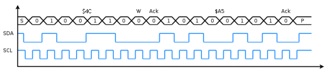

# macos_i2c_rtc_uart

Designer: **Alican Yengec**

 **Tang Primer 20K Board - Gowin GW2A-18C FPGA I2C RTC and UART Project**:
- DS3231 on **I2C**
- interactive menu on **UART** (CoolTerm)

## What this project does

- Reads DS3231 time/date registers over I2C.
- Prints formatted time/date to UART.
- Supports simple UART commands.
- Prints menu automatically at boot.
- Stream mode is OFF by default; you enable it with `FLOW`.

## Project Architecture

```text
Tang Primer 20K / GW2A FPGA

  27 MHz clock
      |
      v
  top_i2c_rtc_uart.sv
      |
      +--> UART RX parser
      |       - receives terminal commands
      |       - accepts MENU, READ, RAW, SET, FLOW, STOP, STATUS
      |
      +--> UART TX printer
      |       - prints menu, status, time, raw registers, and calibration result
      |
      +--> RTC control FSM
      |       - schedules one-shot reads
      |       - schedules SET calibration writes
      |       - schedules stream reads only when FLOW mode is active
      |
      +--> i2c_byte_master.sv
              - generates I2C START, STOP, byte write, byte read, ACK/NACK
              - drives SDA/SCL as open-drain signals
              |
              v
          DS3231 RTC module
```

## Source Module Summary

- `rtl/top_i2c_rtc_uart.sv` : top-level command menu, RTC read/write flow, UART print logic
- `rtl/i2c_byte_master.sv` : byte-level I2C master for START/STOP/read/write/ACK
- `rtl/uart_rx.sv` : 8N1 UART receiver for terminal commands
- `rtl/uart_tx.sv` : 8N1 UART transmitter for terminal output
- `constraints/macos_i2c_rtc_uart.cst` : Tang Primer 20K pin mapping
- `constraints/macos_i2c_rtc_uart.sdc` : 27 MHz timing constraint

## I2C Summary

I2C is a two-wire serial bus:

- `SCL` is the clock line.
- `SDA` is the data line.
- Both lines are open-drain, so devices only pull the line low.
- Pull-up resistors return the line to logic high.
- A transaction starts with `START` and ends with `STOP`.
- Every transferred byte is followed by an ACK/NACK bit.

Basic write shape:

```text
START
  slave_address + write_bit
  register_pointer
  data_byte_0
  data_byte_1
STOP
```

Basic read shape:

```text
START
  slave_address + write_bit
  register_pointer
REPEATED START
  slave_address + read_bit
  read_byte_0 + ACK
  read_byte_1 + ACK
  read_last_byte + NACK
STOP
```

In this project:

- DS3231 7-bit address is `0x68`.
- Write address byte is `0xD0`.
- Read address byte is `0xD1`.
- I2C bus speed is `100 kHz`.

## I2C Wave Shape

The pictures below show the important I2C timing rules more clearly than a text-only drawing.


This timing diagram shows the core rule of the bus:

- `START` happens when `SDA` falls while `SCL` is high.
- `STOP` happens when `SDA` rises while `SCL` is high.
- Normal data changes are allowed while `SCL` is low.
- Data must stay stable while `SCL` is high.

The next picture shows a complete I2C frame with address, data bits, ACK bits, and STOP.



For every byte:

- 8 data bits are transferred first.
- The 9th clock is the ACK/NACK bit.
- ACK means the receiver pulls `SDA` low.
- NACK means `SDA` is released high.

In this project, the FPGA acts as the I2C master. The DS3231 is the slave device at address `0x68`. The FPGA controls `SCL`, drives/releases `SDA`, sends the register pointer, and then reads or writes the DS3231 time registers.

Image sources:

- `media/i2c_data_transfer.svg` from Wikimedia Commons, public domain.
- `media/i2c_frame_diagram.png` from Wikimedia Commons, public domain.

## DS3231 Summary

DS3231 is a real-time clock IC with an integrated temperature-compensated crystal oscillator. It keeps counting seconds, minutes, hours, date, month, and year internally.

Why it is useful:

- FPGA does not need to count calendar time itself.
- DS3231 keeps running from its backup battery when the FPGA board is powered off.
- After power is restored, FPGA can read the current time over I2C.

The time/date registers start at address `0x00`:

```text
0x00 seconds
0x01 minutes
0x02 hours
0x03 day of week
0x04 date
0x05 month
0x06 year
```

DS3231 stores these values as BCD:

```text
decimal 26 -> BCD 0x26
decimal 59 -> BCD 0x59
decimal 04 -> BCD 0x04
```

This project uses 24-hour mode and writes day-of-week as `0x01` during calibration because the dashboard does not currently display weekday.

## RTC Read Flow

For `READ`, `RAW`, and `FLOW`, the FPGA reads a burst starting at register `0x00`:

```text
START
  0xD0              ; DS3231 write address
  0x00              ; register pointer = seconds
REPEATED START
  0xD1              ; DS3231 read address
  seconds  + ACK
  minutes  + ACK
  hours    + ACK
  weekday  + ACK
  date     + ACK
  month    + ACK
  year     + NACK
STOP
```

The same read sequence as a compact bus waveform:

```text
SDA/SCL meaning:
  S  = START
  Sr = repeated START
  P  = STOP
  A  = ACK, SDA low on 9th clock
  N  = NACK, SDA high on 9th clock

       S      address       reg      Sr     address      seconds  minutes  hours    day      date     month    year    P
I2C : |START| 0xD0 |A| 0x00 |A| |REP_START| 0xD1 |A| SEC |A| MIN |A| HOUR |A| DOW |A| DATE |A| MON |A| YEAR |N|STOP|

       master writes this part                 DS3231 sends these bytes back
       ------------------------------------    -----------------------------------------------
```

Why `0xD0` and `0xD1` are used:

```text
DS3231 7-bit address = 0x68 = binary 1101000

write byte:
  1101000 0 = 0xD0
          ^
          write bit

read byte:
  1101000 1 = 0xD1
          ^
          read bit
```

The firmware then formats the BCD registers into:

```text
TIME 20YY-MM-DD HH:MM:SS
```

## RTC Calibration Flow

For `SET YYMMDDHHMMSS`, the FPGA writes a burst starting at register `0x00`:

```text
START
  0xD0              ; DS3231 write address
  0x00              ; register pointer = seconds
  SS                ; seconds, BCD
  MM                ; minutes, BCD
  HH                ; hours, BCD, 24-hour mode
  0x01              ; weekday placeholder
  DD                ; date, BCD
  MM                ; month, BCD
  YY                ; year, BCD
STOP
```

The same calibration write sequence as a compact bus waveform:

```text
       S      address       reg      second  minute  hour    weekday  date    month   year    P
I2C : |START| 0xD0 |A| 0x00 |A|  SS |A| MM |A| HH |A| 0x01 |A| DD |A| MO |A| YY |A|STOP|

       all bytes are driven by the FPGA master
       --------------------------------------------------------------
```

Example:

```text
SET 260426230000
```

This writes:

```text
year  = 0x26
month = 0x04
date  = 0x26
hour  = 0x23
min   = 0x00
sec   = 0x00
```

After calibration, DS3231 continues counting from its backup battery while the FPGA board is powered off.

## UART Commands

Type command then press Enter.

- `MENU` or `M` : print full command menu
- `HELP` or `H` or `?` : print full command menu
- `READ` or `R` : one-shot RTC read and formatted print
- `RAW` : one-shot raw RTC register print
- `SET YYMMDDHHMMSS` or `W YYMMDDHHMMSS` : calibration write to RTC
- `FLOW` or `F` : start 1-second streaming print
- `STOP` or `X` : stop streaming print
- `STATUS` or `S` : print stream + RTC status

Calibration example:
- `SET 260426153045` + Enter -> sets RTC to `2026-04-26 15:30:45`

After one-time calibration, DS3231 keeps counting from backup battery while FPGA/system power is off.

## Usage Examples

At boot, the terminal prints the project banner and command menu. Stream mode is OFF, so time does not continuously flow until you request it.

```text
MENU
```

Prints the menu again.

```text
READ
```

Reads RTC once and prints one formatted line.

```text
RAW
```

Reads RTC once and prints raw DS3231 register values.

```text
SET 260426153045
```

Writes calibration time: `2026-04-26 15:30:45`.

```text
FLOW
```

Starts 1-second streaming output.

```text
X
```

Stops streaming output and returns to menu mode.

```text
STATUS
```

Prints whether stream mode is ON/OFF and whether RTC communication is OK/ERR.

## CoolTerm Log

```text
AAYENGEC RTC+UART READY
Type MENU + Enter
MENU/M   : show menu
READ/R   : read time once
RAW      : read raw regs
SET/W    : set YYMMDDHHMMSS
FLOW/F   : start 1s stream
STOP/X   : stop stream  STATUS/S
S
STATUS stream=OFF rtc=OK 
R
TIME 2026-04-26 21:20:26
RAW
RAW S=33 M=20 H=21 D=26 MO=04 Y=26
SET 
ERR CMD (MENU)
SET 260426230000
RTC CALIB OK
TIME 2026-04-26 23:00:00
R
TIME 2026-04-26 23:00:04
F
STATUS stream=ON  rtc=OK 
TIME 2026-04-26 23:00:06
TIME 2026-04-26 23:00:06
TIME 2026-04-26 23:00:07
TIME 2026-04-26 23:00:08
TIME 2026-04-26 23:00:09
TIME 2026-04-26 23:00:10
TIME 2026-04-26 23:00:11
TIME 2026-04-26 23:00:12
TIME 2026-04-26 23:00:13
TIME 2026-04-26 23:00:14
X
MENU/M   : show menu
READ/R   : read time once
RAW      : read raw regs
SET/W    : set YYMMDDHHMMSS
FLOW/F   : start 1s stream
STOP/X   : stop stream  STATUS/S
R
TIME 2026-04-26 23:00:24
M
MENU/M   : show menu
READ/R   : read time once
RAW      : read raw regs
SET/W    : set YYMMDDHHMMSS
FLOW/F   : start 1s stream
STOP/X   : stop stream  STATUS/S
R
TIME 2026-04-26 23:00:31
R
TIME 2026-04-26 23:00:34
S
STATUS stream=OFF rtc=OK 
```

The following log was captured after powering the FPGA system off for a while and powering it back on. The DS3231 kept time from its backup battery, and the FPGA read the continued time after reboot.

```text
AAYENGEC RTC+UART READY
Type MENU + Enter
MENU/M   : show menu
READ/R   : read time once
RAW      : read raw regs
SET/W    : set YYMMDDHHMMSS
FLOW/F   : start 1s stream
STOP/X   : stop stream  STATUS/S
R
TIME 2026-04-27 00:33:43
R
TIME 2026-04-27 00:33:45
F
TIME 2026-04-27 00:33:47
TIME 2026-04-27 00:33:48
TIME 2026-04-27 00:33:49
TIME 2026-04-27 00:33:50
TIME 2026-04-27 00:33:51
TIME 2026-04-27 00:33:52
```

## UART Setup

- Baudrate: `115200`
- Data bits: `8`
- Parity: `None`
- Stop bits: `1`
- Flow control: `None`
- Terminal line mode: `CR+LF` recommended

## Wiring

### Tang Primer 20K pins

- `clk_27m` -> `H11`
- `rst_n` -> `T10`
- `uart_tx` -> `M11`
- `uart_rx` -> `T13`
- `i2c_scl` -> `A11`
- `i2c_sda` -> `B11`

### DS3231

- `VCC` -> `3V3`
- `GND` -> `GND`
- `SCL` -> `A11`
- `SDA` -> `B11`

Important:
- I2C is open-drain, so SDA/SCL need pull-up resistors to 3.3V (typically `4.7k`).
- Many DS3231 modules already include pull-ups.

## Project Files

- `rtl/top_i2c_rtc_uart.sv`
- `rtl/i2c_byte_master.sv`
- `rtl/uart_tx.sv`
- `rtl/uart_rx.sv`
- `constraints/macos_i2c_rtc_uart.cst`
- `constraints/macos_i2c_rtc_uart.sdc`
- `macos_i2c_rtc_uart.gprj`

## Gowin Build (macOS)

1. Open `macos_i2c_rtc_uart.gprj`.
2. `Finder -> Settings -> Synthesize -> Language` set to `SystemVerilog`.
3. Run Synthesize.
4. Run Place & Route.
5. Program `.fs` with Gowin Programmer.

## Notes

- RTC read sequence used:
  - write pointer `0x00`
  - repeated-start read of sec/min/hour/day/date/month/year
- RTC write (calibration) sequence used:
  - write pointer `0x00`
  - write sec/min/hour/day/date/month/year in one burst
- `led[1]` shows RTC-valid status.
- `led[2]` shows stream mode (FLOW/STOP).
- `led[3]` shows RTC FSM busy.
