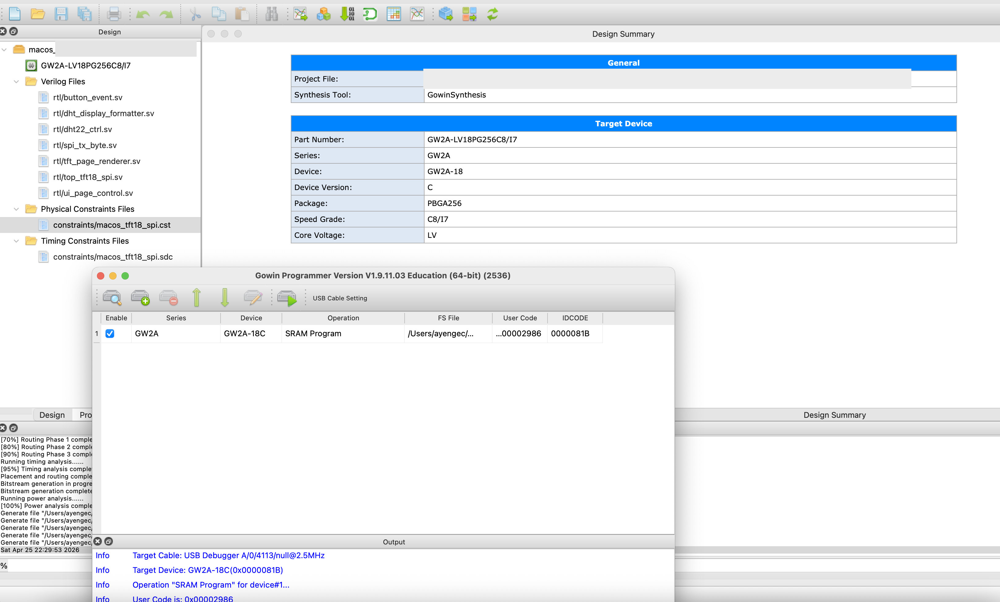

# macos_tft18_spi_dht22

SystemVerilog project for **Sipeed Tang Primer 20K (GW2A)** to drive a **1.8-inch 128x160 SPI TFT** module and read a **DHT22** sensor.

## macOS Status
- Project is prepared for native Gowin flow on macOS.
- No VM is required.

## macOS Compile Screenshot
The screenshot below shows a successful native macOS flow in Gowin IDE/Programmer for this project.



What it shows:
- Gowin project opened and constraints/RTL files loaded.
- Synthesis/Place&Route flow completed and bitstream generated.
- Gowin Programmer target detected and SRAM programming executed.
- Private path field in the top summary area is intentionally masked for privacy.

## Video

[](https://youtube.com/shorts/BEo2JCxCg0I?feature=share)

## What This Project Does
- Initializes an ST77xx-family TFT panel over SPI.
- Continuously refreshes the full 128x160 frame.
- Shows 7 pages, including an `AYENGEC` page and a DHT22 monitor page.
- Reads DHT22 periodically while the DHT page is active.
- Keeps RTL modular (`ui_page_control`, `dht_display_formatter`, `tft_page_renderer`).

## Interface Standards Used
- LCD link: `SPI` (4-wire: `SCK`, `MOSI/SDA`, `CS`, `DC/A0`) with ST77xx command/data framing.
- Sensor link: `one-wire` style single-data-line protocol used by DHT22 (timing-based bit decode).
- Practical note: DHT22 protocol is single-wire but not Maxim/Dallas ROM 1-Wire command set.

## Repository Layout (Relative Paths)
```text
macos_tft18_spi_dht22/
|- macos_tft18_spi_dht22.gprj
|- README.md
|- macos_compiled_screenshot.png
|- constraints/
|  |- macos_tft18_spi_dht22.cst
|  `- macos_tft18_spi_dht22.sdc
`- rtl/
   |- top_tft18_spi.sv
   |- tft_page_renderer.sv
   |- ui_page_control.sv
   |- dht_display_formatter.sv
   |- dht22_ctrl.sv
   |- spi_tx_byte.sv
   `- button_event.sv
```

## Code Architecture (Module Responsibilities)
- `rtl/top_tft18_spi.sv`: Top-level integration; ST77xx init/frame transfer FSM; connects all submodules.
- `rtl/tft_page_renderer.sv`: Pixel generator for all pages/patterns (color bars, gradient, AYENGEC, DHT page UI).
- `rtl/ui_page_control.sv`: Button event handling (`next/prev`), frame-boundary-safe page switch, DHT-page timer, periodic DHT start pulse.
- `rtl/dht_display_formatter.sv`: Converts DHT raw values to display digits (`xx.x`) and holds last valid/error status.
- `rtl/dht22_ctrl.sv`: DHT22 low-level timing controller (single-wire start/response/bit capture + checksum validity).
- `rtl/spi_tx_byte.sv`: SPI mode-0 byte transmitter used by TFT transfer FSM.
- `rtl/button_event.sv`: Debounce + single-pulse press detector for active-low buttons.
- `constraints/macos_tft18_spi_dht22.cst`: Pin mapping and IO electrical settings.
- `constraints/macos_tft18_spi_dht22.sdc`: Base clock constraint.

## Why FPGA Instead of MCU Here?
Yes, this could also be done on a small MCU.
We intentionally built it on FPGA to practice:
- Native macOS Gowin flow (synthesis + PnR + programming).
- Writing protocol controllers in SystemVerilog.
- Designing timing/state-machine based interfaces for real hardware.

So this project is both a working demo and a protocol-learning exercise.

## Controls
- `S1` (`btn_mode_n`, pin `T3`): next pattern/page.
- `S2` (`btn_auto_n`, pin `T2`): previous pattern/page.

Notes:
- No auto-rotation mode is used.
- In pattern `6`, DHT22 is sampled periodically.
- DHT22 core enforces minimum 2-second gap between measurements.

## Pattern List
- Pattern 0: solid red
- Pattern 1: solid green
- Pattern 2: solid blue
- Pattern 3: vertical color bars
- Pattern 4: gradient
- Pattern 5: `AYENGEC` text on dark background
- Pattern 6: DHT22 monitor (`temp xx.x`, `humid xx.x`)

DHT22 status stripe on top of pattern 6:
- Green: latest sample is valid
- Orange: measurement in progress
- Blue: no valid sample yet
- Red: latest measurement failed

DHT22 behavior in pattern 6:
- Measurement starts automatically when you enter pattern 6.
- Then it continues periodically (every ~2 seconds, limited by sensor timing).
- A small `AYENGEC` label is shown at top-left.
- A 1-Hz corner timer (`00..99`) is shown at top-right.

Why not 1-second DHT reads?
- DHT22 is usually specified for at least ~2-second sampling interval.
- So UI timer is 1 Hz, but sensor capture is ~2 seconds for stable operation.

## Debug LEDs
- `led[2:0]`: current pattern index
- `led[3]`: panel init done flag

## Wiring
This project uses your requested pin group:
- `A11 B11 N6 D11 N9 N7 L9 C12`

TFT mapping:
- `SCK`   -> `A11` (`lcd_clk`)
- `SDA`   -> `B11` (`lcd_data`, MOSI)
- `A0/DC` -> `N6`  (`lcd_rs`)
- `RESET` -> `D11` (`lcd_resetn`)
- `CS`    -> `N9`  (`lcd_cs`)
- `LED`   -> `N7`  (`lcd_bl`)

DHT22 mapping:
- `DATA`  -> `C12` (`dht22_io`)

Spare from your list:
- `L9`

Power wiring:
- TFT `GND` -> board `GND`
- TFT `VCC` -> board `3V3` (or according to your module spec)
- DHT22 `VCC` -> board `3V3`
- DHT22 `GND` -> board `GND`

Important for DHT22:
- Add external pull-up resistor (`4.7k` typical) between `DATA` and `3V3`.

## Important TFT Note
Many 1.8-inch boards are sold as `ST7735` even when listings write `ST77xx`/`ST7725`.
This RTL uses common ST77xx commands and usually works on ST7735-class modules.

If the image is shifted or orientation is wrong, edit these in `rtl/top_tft18_spi.sv`:
- `X_OFFSET`
- `Y_OFFSET`
- `MADCTL` data byte (currently `8'h00` in `ST_INIT_DATA_MADCTL`)

If screen stays black, first try backlight polarity in the same file:
- `BL_ON_LEVEL` (default `1'b1`)

## Gowin Build Steps (macOS)
1. Open `macos_tft18_spi_dht22.gprj`.
2. Go to `Project -> Settings -> Synthesize`.
3. Set language to `SystemVerilog` (instead of Verilog).
4. If you get dedicated pin errors for SSPI/JTAG pins (for example `cannot be placed` or `constrained location is useless`), go to:
   `Project -> Configuration -> Place & Route -> Dual-Purpose Pin`
   then enable `Use SSPI as regular IO`.
5. Run `Synthesize`.
6. Run `Place & Route`.
7. Run `Generate Bitstream`.
8. Open Gowin Programmer and download the generated `.fs` file.

## Architecture (Abstract)
```text
clk_27m + buttons + dht22_io
      |
      v
+-------------------------------+
| top_tft18_spi                 |
|  - reset + ST77xx transfer FSM |
|  - frame scan (x,y)            |
+-----------+----------+---------+
            |          |                   |
            v          v                   v
   +----------------+  +----------------+  +----------------------+
   | ui_page_control|  |tft_page_renderer| | dht_display_formatter|
   +--------+-------+  +--------+-------+  +----------+-----------+
            |                   |                     |
            v                   v                     v
      pattern_idx        pixel_color            display digits/flags
            |                   |                     ^
            |                   v                     |
            |             +-----------+               |
            |             | spi_tx_byte|              |
            |             +-----+-----+               |
            |                   |                     |
            +---------------> +------+ <--------------+
                               |dht22_ctrl|
                               +----+-----+
                                    |
                                    +--> dht22_io (DHT single-wire)
```

## Protocol Notes (Wave + Frame)

### SPI Used For TFT
The `spi_tx_byte` block uses **SPI mode-0**:
- `CPOL = 0`, `CPHA = 0`
- `SCLK` idle is low
- Target samples `MOSI` on rising edge
- Data is sent MSB first

Wave sketch for one bit:
```text
CS     : ____\_________________/____
SCLK   : ____/--\____/--\____/--\___
MOSI   : ==== D7 ==== D6 ==== D5 ===
            ^sample  ^sample  ^sample
```

Wave sketch for one byte:
```text
CS     : ____\____________________________________/____
SCLK   : ____/-\_/-\_/-\_/-\_/-\_/-\_/-\_/-\___________
MOSI   : ====D7==D6==D5==D4==D3==D2==D1==D0============
```

### DHT22 Single-Wire Protocol (Not Dallas 1-Wire)
Important note:
- DHT22 uses its own single-wire timing protocol.
- It is **not** Maxim/Dallas 1-Wire ROM protocol.

Transaction flow:
1. Host pulls DATA low for about `1.2 ms`.
2. Host releases DATA (line pulled high).
3. Sensor response: `~80 us low` + `~80 us high`.
4. Sensor sends 40 bits.

Start + response wave sketch:
```text
DATA   : -------\______________________/--\________/----...
             host low ~1.2ms            80us low 80us high
```

Each data bit timing:
- Bit starts with `~50 us low`.
- Then high pulse width decides bit value:
  - `0` -> high `~26..28 us`
  - `1` -> high `~70 us`

Bit wave sketch:
```text
bit=0  : ____/--\____________________
          50us 26-28us

bit=1  : ____/--------\______________
          50us   ~70us
```

40-bit frame composition:
```text
[39:32] Humidity integer byte
[31:24] Humidity decimal byte
[23:16] Temperature integer byte
[15:8]  Temperature decimal/sign byte
[7:0]   Checksum
```

Checksum rule:
```text
checksum == (byte0 + byte1 + byte2 + byte3) & 8'hFF
```

## Troubleshooting
- If synthesis/pnr passes but display is blank:
  - check TFT wiring order carefully (`A0/DC`, `CS`, `RESET`)
  - try `BL_ON_LEVEL = 1'b1`
  - verify module supports 4-wire SPI mode
- If DHT22 page shows red stripe:
  - check pull-up resistor on `DATA`
  - verify DHT22 power is `3V3` and ground is common
  - stay on pattern `6` for a few seconds and let periodic sampling run
- If colors look swapped:
  - tune `MADCTL` data byte
- If image is offset/clipped:
  - tune `X_OFFSET` and `Y_OFFSET`
