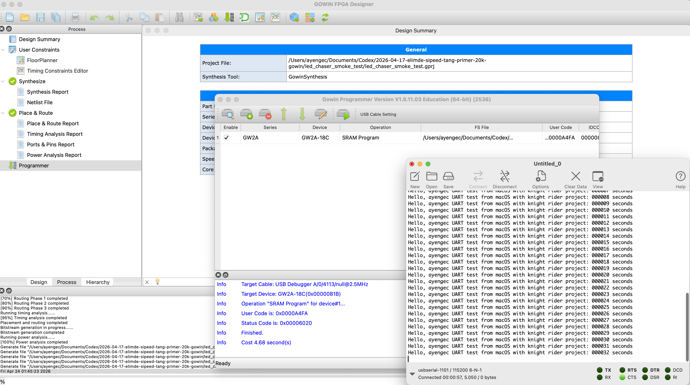

# Tang Primer 20K LED Chaser Smoke Test

This is a minimal project to verify:
- Gowin IDE project opens,
- synthesis/PnR/bitstream generation works,
- download to board works,
- board clock + LEDs are alive,
- UART TX output is alive on macOS terminal tools.

## Behavior
- 4 LEDs run a Knight Rider style pattern: `0 -> 1 -> 2 -> 3 -> 2 -> 1 -> ...`
- Step period is ~100 ms.
- UART transmits one line per second:
  - `Hello, ayengec UART test from macOS with knight rider project: XXXXXX seconds`
  - `XXXXXX` is a 6-digit seconds counter (`000001`, `000002`, ...).

## Files
- `rtl/uart_tx.sv`
- `rtl/top_led_chaser.sv`
- `constraints/led_chaser_smoke_test.cst`
- `constraints/led_chaser_smoke_test.sdc`
- `led_chaser_smoke_test.gprj`

## Build (Gowin IDE)
1. Open `led_chaser_smoke_test.gprj`.
2. Go to `Project -> Settings -> Synthesize`.
3. Set **Language** from `Verilog` to `SystemVerilog`, then click **OK**.
4. Run **Synthesize**.
5. Run **Place & Route**.
6. Run **Generate Bitstream**.

## Program (Gowin Programmer)
1. Connect board with USB-C (JTAG/programming side).
2. Open Gowin Programmer.
3. Select cable/device.
4. Load generated `.fs` file.
5. Click **Program/Download**.

## UART Monitor (CoolTerm on macOS)
1. Open CoolTerm.
2. Select serial port connected to board/UART bridge (`/dev/cu.usbserial-*`).
3. Set:
   - `Baudrate = 115200`
   - `Data bits = 8`
   - `Parity = None`
   - `Stop bits = 1`
   - `Flow control = None`
4. Enable `Local Echo` if you want to see typed characters.
5. Connect and observe periodic text output once per second.

## Serial Port Tips (macOS)
1. Use the board USB-C port for **JTAG + UART** (not OTG).
2. In Terminal, list serial ports:
   - `ls /dev/cu.*`
3. Typical ports look like:
   - `/dev/cu.usbserial-1100`
   - `/dev/cu.usbserial-1101`
4. If you are not sure which one is active, try both in CoolTerm.

## Expected UART Output
```text
Hello, ayengec UART test from macOS with knight rider project: 000001 seconds
Hello, ayengec UART test from macOS with knight rider project: 000002 seconds
Hello, ayengec UART test from macOS with knight rider project: 000003 seconds
...
```

## Known-Good Validation (2026-04-24)
- Board: Tang Primer 20K (GW2A)
- OS: macOS
- Tool: Gowin FPGA Designer + Gowin Programmer + CoolTerm
- Result: Build, program, LED chase, and 1-second UART stream all verified.



## If UART Does Not Appear
1. Re-check `Project -> Settings -> Synthesize -> Language = SystemVerilog`.
2. Re-generate bitstream and re-program FPGA.
3. Confirm CoolTerm uses `115200 8-N-1` and `Flow control = None`.
4. Make sure no other app is holding the serial port.
5. Test the other `/dev/cu.usbserial-*` port.

## Expected result
- After successful download, LEDs should move continuously.
- UART should print one incrementing sentence every second.
- If LEDs move and UART lines arrive, your macOS toolchain + programming + serial path are verified.
