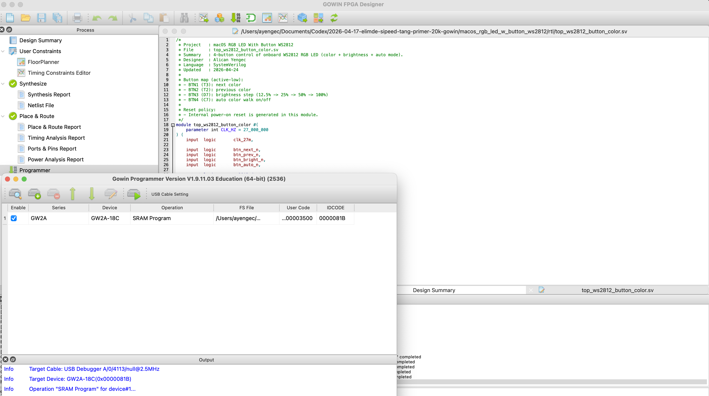
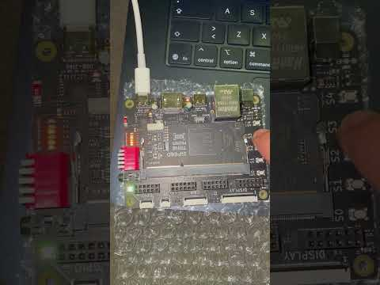
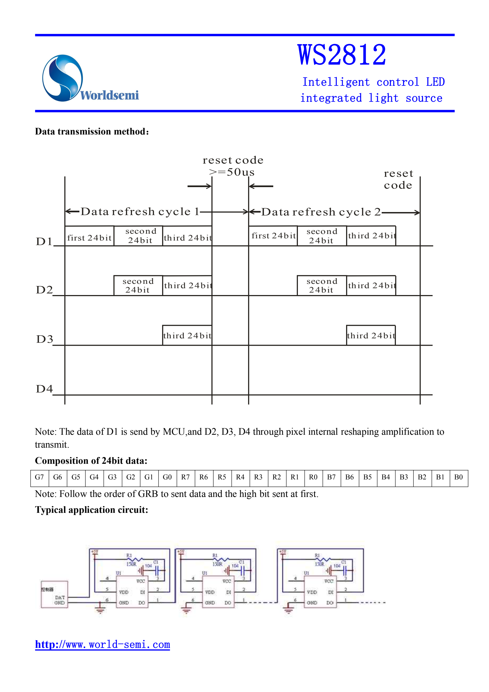

# macos_rgb_led_w_button_ws2812

A small SystemVerilog project for Tang Primer 20K (GW2A) that drives the onboard WS2812 RGB LED.

## macOS Build/Run Status
- This project was built and tested on **macOS** with native Gowin tools (no VM).

## Native Gowin IDE Screenshot (macOS)
The image below shows Gowin FPGA Designer / Programmer running natively on macOS during build and download.



## Video
This short clip shows the project behavior on hardware (WS2812 color changes with button control).

[](https://youtube.com/shorts/T-TFq8TVYHs?feature=share)

## What This Project Does
- Drives one WS2812 RGB LED on pin `T9`.
- Uses 4 buttons to control color and brightness in real time.
- Uses pure RTL (no IP) for button handling and WS2812 protocol timing.

## Hardware Note (Onboard RGB LED)
- Yes, this board/dock setup includes an onboard addressable RGB LED connected as a `WS2812`-type device.
- The FPGA drives this LED through a single data pin (`T9`), not through separate `R/G/B` PWM pins.

## WS2812 Protocol Summary
- Physical interface: one-wire digital output (`ws2812_dout`).
- Data format per LED: `24 bits` in `GRB` order (`G[7:0]`, `R[7:0]`, `B[7:0]`), MSB first.
- Logic encoding is timing-based (pulse-width), not UART/SPI.
  - Bit `0`: shorter high pulse, longer low pulse.
  - Bit `1`: longer high pulse, shorter low pulse.
- After sending 24 bits, line is held low for reset/latch (`>50 us`) so LED updates color.

Implementation values used in this project (`27 MHz` clock):
- `T0H_CYCLES = 11`  (~0.41 us high)
- `T1H_CYCLES = 22`  (~0.81 us high)
- `BIT_CYCLES = 34`  (~1.26 us bit period)
- `RESET_CYCLES = 2200` (~81 us low reset)

## Official Datasheet Figure (Page 5)
- Source PDF: `media/WS2812.pdf`
- Reference link: `https://cdn-shop.adafruit.com/datasheets/WS2812.pdf`
- Extracted image used in this project: `media/ws2812_datasheet_page5.png`

This figure shows two key items directly from the vendor datasheet:
- Data transmission timing concept (`0/1` pulse-width based refresh with reset code).
- Bit composition order (`G7..G0`, then `R7..R0`, then `B7..B0`, MSB first).



## WS2812 Timing Diagram (ASCII)
```text
WS2812 one-wire signal (time ->)

Bit '0'  (short HIGH, long LOW)
DIN:  ___|¯¯¯¯¯¯¯¯¯¯|_______________________|___
         <--- T0H ---><------- rest ------->   (total = BIT_CYCLES)

Bit '1'  (long HIGH, short LOW)
DIN:  ___|¯¯¯¯¯¯¯¯¯¯¯¯¯¯¯¯¯¯¯¯¯¯|___________|___
         <------- T1H ---------><-- rest -->   (total = BIT_CYCLES)
```

Frame format sent to one LED:
```text
[ G7..G0 ][ R7..R0 ][ B7..B0 ] + LOW(>50us reset/latch)
```

Example frame (pure red):
```text
Target color (RGB): R=0xFF, G=0x00, B=0x00
WS2812 byte order : G, R, B

Bytes on wire:
[ 0x00 ][ 0xFF ][ 0x00 ]

Bits on wire (MSB first):
[ 00000000 ][ 11111111 ][ 00000000 ] + LOW(>50us)
```

Example frames for pure colors:
```text
Pure GREEN (RGB = 00 FF 00):
GRB bytes: [ 0xFF ][ 0x00 ][ 0x00 ]
Bits     : [ 11111111 ][ 00000000 ][ 00000000 ] + LOW(>50us)

Pure RED (RGB = FF 00 00):
GRB bytes: [ 0x00 ][ 0xFF ][ 0x00 ]
Bits     : [ 00000000 ][ 11111111 ][ 00000000 ] + LOW(>50us)

Pure BLUE (RGB = 00 00 FF):
GRB bytes: [ 0x00 ][ 0x00 ][ 0xFF ]
Bits     : [ 00000000 ][ 00000000 ][ 11111111 ] + LOW(>50us)
```

Waveform-like frame sketches (ASCII, not to scale):
```text
Bit-cell legend:
1-cell: __|¯¯¯¯¯¯¯¯¯¯¯¯|____|
0-cell: __|¯¯¯¯|____________|

Pure GREEN  (GRB = FF 00 00):
DIN bits: [11111111][00000000][00000000] + RESET
DIN wav : |1|1|1|1|1|1|1|1|0|0|0|0|0|0|0|0|0|0|0|0|0|0|0|0|____LOW____|
          <--- G byte ---><--- R byte ---><--- B byte --->

Pure RED    (GRB = 00 FF 00):
DIN bits: [00000000][11111111][00000000] + RESET
DIN wav : |0|0|0|0|0|0|0|0|1|1|1|1|1|1|1|1|0|0|0|0|0|0|0|0|____LOW____|
          <--- G byte ---><--- R byte ---><--- B byte --->

Pure BLUE   (GRB = 00 00 FF):
DIN bits: [00000000][00000000][11111111] + RESET
DIN wav : |0|0|0|0|0|0|0|0|0|0|0|0|0|0|0|0|1|1|1|1|1|1|1|1|____LOW____|
          <--- G byte ---><--- R byte ---><--- B byte --->
```

## Button Mapping
- `BTN1` (`T3`): next color
- `BTN2` (`T2`): previous color
- `BTN3` (`D7`): brightness step (`12.5% -> 25% -> 50% -> 100% -> repeat`)
- `BTN4` (`C7`): auto color walk ON/OFF

## Board Button Names (S0..S4)
- `S0` -> `T10`
- `S1` -> `T3`
- `S2` -> `T2`
- `S3` -> `D7`
- `S4` -> `C7`

Meaning:
- `S0` is commonly used as reset in many examples.
- `S1..S4` are user buttons with no fixed hardware function; project logic defines their behavior.
- Buttons are active-low (`pressed = 0`, `released = 1`).

## Reset
- This design uses an internal power-on reset (no external reset pin constraint).

## Status LEDs
- `led[0]`: toggles each WS2812 frame (alive indicator)
- `led[1]`: auto mode status (`1 = ON`)
- `led[2:3]`: brightness level bits

## Project Files
- `rtl/top_ws2812_button_color.sv`
- `rtl/color_controller.sv`
- `rtl/ws2812_tx.sv`
- `rtl/button_event.sv`
- `constraints/macos_rgb_led_w_button_ws2812.cst`
- `constraints/macos_rgb_led_w_button_ws2812.sdc`
- `macos_rgb_led_w_button_ws2812.gprj`
- `media/WS2812.pdf`
- `media/ws2812_datasheet_page5.png`
- `media/macos_gowin_ide.png`
- `media/youtube_short_thumbnail.jpg`

## Build In Gowin FPGA Designer (macOS)
1. Open `macos_rgb_led_w_button_ws2812.gprj`.
2. Go to `Project -> Settings -> Synthesize`.
3. Set `Language = SystemVerilog`.
4. Go to `Project -> Configuration -> Place & Route -> Dual-Purpose Pin` and enable:
   - `Use SSPI as regular IO`
5. Run `Synthesize`.
6. Run `Place & Route`.
7. Run `Generate Bitstream`.

## Program FPGA
1. Open Gowin Programmer.
2. Select cable/device (`GW2A-18C`).
3. Load generated `.fs` file.
4. Click `Program/Download`.

## Expected Result
- Onboard WS2812 LED changes color when buttons are pressed.
- Brightness cycles with BTN3.
- Auto mode continuously walks through palette when BTN4 is enabled.

## Notes
- This project assumes Tang Primer 20K Dock pin map where WS2812 is on `T9`.
- If your board revision uses different button pins, update only the `.cst` file.
- If your tool still reports dedicated-pin errors, also enable `Use CPU as regular IO`.

## Common PnR Error and Fix (PR2017 / PR2028)
If you see:
- `ERROR (PR2028): The constrained location is useless in current package`
- `ERROR (PR2017): 'ws2812_dout' cannot be placed according to constraint, for the location is a dedicated pin (SSPI)`

This means pin `T9` is still reserved by SSPI mode.

Fix steps:
1. Open `Project -> Configuration`.
2. Go to `Place & Route -> Dual-Purpose Pin`.
3. Enable `Use SSPI as regular IO`.
4. Re-run `Synthesize` and `Place & Route`.
